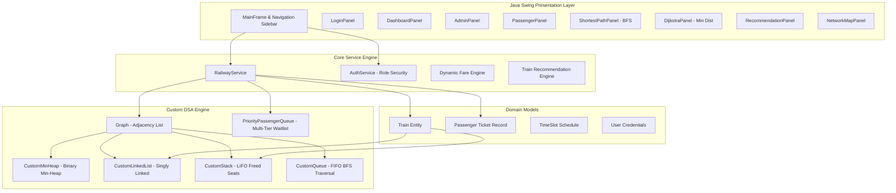

# 🚆 Smart Railway Management & Route Optimization System

[](https://www.oracle.com/java/)
[](https://github.com/)
[](https://github.com/)
[-6366F1?style=for-the-badge)](https://github.com/)
[](https://github.com/)
[](LICENSE)

> **A high-performance, algorithmic Railway Management and Pathfinding System engineered from scratch in Java without external collection libraries.** Built using custom-implemented fundamental data structures (Binary Min-Heap, Adjacency Lists, Priority Queues, Stacks, Queues, Linked Lists), graph pathfinding algorithms (Dijkstra's Algorithm, Breadth-First Search), and a modern enterprise Java Swing user interface with zero external dependencies.

---

## 📌 Executive Summary & Resume Highlights

- **Custom-Built Data Structure Engine**: Engineered all fundamental data structures (`CustomMinHeap`, `CustomLinkedList`, `CustomStack`, `CustomQueue`, and `PriorityPassengerQueue`) from first principles without relying on `java.util.*` collections (such as `LinkedList`, `PriorityQueue`, `Stack`, or `ArrayList`).
- **Dual Graph Pathfinding Engine**: Implemented **Dijkstra's Shortest Path Algorithm** with a custom binary min-heap for physical distance optimization ($O((V + E) \log V)$) and **Breadth-First Search (BFS)** with a custom FIFO queue for fewest-station transit routing ($O(V + E)$).
- **Automated Waitlist Promotion via Priority Queue**: Designed a multi-tier priority queue with stable FIFO ordering (Priority 1: Senior Citizens $\ge$ 60 yrs, Priority 2: Women, Priority 3: General) that automatically promotes passengers upon ticket cancellation.
- **LIFO Freed-Seat Recycling Stack**: Utilized per-category custom stacks to achieve $O(1)$ seat reclamation and re-allocation when bookings are cancelled.
- **Multi-Criteria Train Recommendation System**: Developed an engine evaluating available trains along shared route segments, ranking options across minimum distance, lowest fare, fewest stops, and earliest departure time.
- **Enterprise Desktop GUI**: Engineered an event-driven desktop interface featuring responsive 2-column forms, station-level timetable management, and collapsible output & activity cards.

---

## 🏛️ System Architecture



---

## 🧠 Deep-Dive: Data Structures & Algorithms Implementation

| Data Structure / Algorithm | File | Application within System | Time Complexity | Space Complexity |
|---|---|---|---|---|
| **Binary Min-Heap** | `CustomMinHeap.java` | Priority Queue for Dijkstra's Shortest Path algorithm | Insert: $O(\log V)$<br>ExtractMin: $O(\log V)$ | $O(V)$ |
| **Dijkstra's Algorithm** | `Graph.java` | Minimum physical distance routing between stations | $O((V + E) \log V)$ | $O(V + E)$ |
| **Breadth-First Search (BFS)** | `Graph.java` | Fewest-hop transit routing across station graph | $O(V + E)$ | $O(V)$ |
| **Custom Stack (Array-based)** | `CustomStack.java` | 1. Reverse path reconstruction in BFS & Dijkstra<br>2. LIFO freed seat number recycling upon cancellation | Push: $O(1)$<br>Pop: $O(1)$ | $O(N)$ |
| **Custom Queue (Linked)** | `CustomQueue.java` | FIFO queue for BFS graph traversal | Enqueue: $O(1)$<br>Dequeue: $O(1)$ | $O(V)$ |
| **Custom Singly Linked List** | `CustomLinkedList.java` | Train route sequence, schedule stops, passenger manifests, graph adjacency lists | Add: $O(N)$<br>Lookup: $O(N)$ | $O(N)$ |
| **Priority Passenger Queue** | `PriorityPassengerQueue.java` | Waiting list scheduling (Senior Citizen > Ladies > General with FIFO preservation) | Enqueue: $O(K)$<br>Dequeue: $O(1)$ | $O(K)$ |

---

## 💻 Key Features

### 1. Dynamic Pathfinding & Route Optimization
- **Fewest Stops (BFS)**: Computes the route with the fewest intermediate train transfers/station hops.
- **Shortest Distance (Dijkstra)**: Traverses the railway network to identify the path with minimum physical kilometers.
- **Path Reconstruction**: Backtracks via parent pointers pushed to `CustomStack` to print formatted step-by-step station routes.

### 2. Smart Booking & LIFO Seat Recycling
- Category-wise quota management: **AC**, **Sleeper (SLPR)**, and **General (GEN)**.
- When an active ticket is cancelled:
  1. The released seat number is pushed onto category-specific `CustomStack` (`acFreedSeats`, `slprFreedSeats`, `genFreedSeats`).
  2. The system checks the `PriorityPassengerQueue` (waiting list).
  3. If eligible waiting passengers exist, the highest-priority passenger is promoted immediately, popping the recycled seat number in $O(1)$ time.

### 3. Multi-Tier Waitlist Priority Scheduling
- Passengers booking when quotas are filled are added to the waiting list.
- Priority assignment:
  - **Tier 1 (Highest)**: Senior Citizens (Age $\ge$ 60)
  - **Tier 2**: Female Passengers
  - **Tier 3 (Standard)**: General
- Equal-priority passengers are strictly served in First-In, First-Out (FIFO) arrival order.

### 4. Dynamic Fare Calculation Engine
$$\text{Fare} = \left( \text{Base Fare} + (\text{Distance} \times 0.50) + \text{Category Charge} \right) \times \text{Weekend Multiplier}$$
- Base Fare: Rs. 150
- Category Charges: AC = Rs. 500, Sleeper = Rs. 150, General = Rs. 0
- Weekend Surcharge: +20% on Saturdays & Sundays.

### 5. Multi-Criteria Train Recommendations
- Compares all trains servicing the route order and displays:
  - Fastest / Minimum Distance Train
  - Most Economical / Lowest Fare Train
  - Earliest Departure Train
  - Minimum Stop Count Train

### 6. Multi-Field Ticket Search & Filter (Feature 4)
- Allows passengers and staff to look up records by:
  - Exact Ticket ID (e.g. `P1001`)
  - Full or partial Passenger Name (case-insensitive)
  - Passenger Mobile / Contact Number
- Scans confirmed manifests, active waiting queues, and historical cancellation lists in $O(N)$ time.

### 7. Official Printable Ticket Receipt Exporter (Feature 3)
- Generates and writes formatted text receipts to `receipts/ticket_<ID>.txt` with:
  - Ticket ID, status, and train details
  - Passenger demographics and priority category
  - Journey origin and destination with travel date
  - Allocated seat/coach ID and itemized fare
  - Official railway travel instructions and policies

### 8. Responsive 2-Column Booking Form & Station-by-Station Schedule Manager
- **2-Column Responsive Ticket Booking Form**: Form organized into *Journey Details* (Train, Date, Origin, Destination, Class) and *Passenger Details* (Name, Age, Gender, Mobile, Priority), enclosed in a smooth-scrolling `JScrollPane` ensuring 100% visibility of all inputs and the "Confirm & Book Ticket" button on all screen sizes and display scalings.
- **Station-by-Station Schedule & Timetable Engine**: Replaced blank manual tables with an intuitive station dropdown that automatically extracts route stops and pre-populates existing arrival/departure times. Includes 1-click timetable saves and interactive row selection.
- **Dedicated Passenger Timetable Tab**: Real-time inspection of train arrival/departure timings directly from the Passenger portal.

### 9. Modern Enterprise Output & Activity Card (Light UI)
- **Zero "Black Screens"**: Completely eliminated dark, terminal-style console boxes in favor of clean, white-card enterprise design language (`#FFFFFF` background, `#F1F5F9` slate header, `#1E293B` readable charcoal text).
- **Interactive Utility Toolbar**: Includes real-time status pill badge (`READY`), 1-click **`📋 Copy`** to clipboard, **`🗑️ Clear`** button, and **`▾ Minimize / ▲ Expand`** toggle to collapse the output area to a compact 36px bar for maximum form real estate.
- **Smart Auto-Expansion**: Automatically un-minimizes whenever fresh journey, routing, or booking activity is reported.

---

## 🗂️ Project Directory Structure

```text
railway-management-project/
├── .vscode/
│   ├── settings.json              # Source/output paths & Java settings
│   └── launch.json                # F5 Run/Debug targets for VS Code
├── bin/                           # Compiled Java bytecode
├── src/
│   └── railway/
│       ├── RailwayManagementSystem.java  # Application Entry Point
│       ├── DSATestSuite.java             # Automated Verification Suite (61 unit tests)
│       │
│       ├── CustomLinkedList.java         # Singly linked list (with inner Node)
│       ├── CustomQueue.java              # FIFO queue implementation
│       ├── CustomStack.java              # LIFO stack implementation
│       ├── CustomMinHeap.java            # Binary min-heap implementation (with inner HeapNode)
│       ├── PriorityPassengerQueue.java   # Priority queue for waitlist scheduling (with inner PriorityNode)
│       ├── Graph.java                    # Railway network graph & pathfinders
│       │
│       ├── Train.java                    # Train entity with seat quotas
│       ├── Passenger.java                # Ticket entity with priority scoring
│       ├── TimeSlot.java                 # Schedule arrival/departure slot
│       ├── User.java                     # User credentials & authentication role
│       │
│       ├── RailwayService.java           # Central business logic & core engine
│       ├── AuthService.java              # Session & role-based authentication manager
│       │
│       ├── RailwayTheme.java             # Modern design system & light card output factory
│       ├── MainFrame.java                # Main frame with card navigation
│       ├── BasePanel.java                # Clean form & activity card base template
│       ├── Refreshable.java              # Dynamic data refresh interface
│       ├── LoginPanel.java               # Authentication screen
│       ├── DashboardPanel.java           # Real-time metrics overview
│       ├── AdminPanel.java               # Train & station route management
│       ├── PassengerPanel.java           # Booking & ticket management panel
│       ├── ShortestPathPanel.java        # BFS route GUI
│       ├── DijkstraPanel.java            # Dijkstra route GUI
│       ├── RecommendationPanel.java      # Train recommendation GUI
│       ├── NetworkMapPanel.java          # Formatted network map display
│       └── ScheduleUpdatePanel.java      # Station-by-station schedule manager & timetable
│
├── run.bat                        # Unified 1-click launcher (GUI: double-click; Tests: 'run.bat test')
└── README.md                      # Comprehensive project documentation
```

---

## 🚀 Getting Started & Execution Guide

### Prerequisites
- **Java Development Kit (JDK 17 or later)**: Java 17, 21, or 24.
- **Visual Studio Code** (with the *Extension Pack for Java* installed).

### Method 1: Running Directly in Visual Studio Code (Recommended)
1. Open the project folder in VS Code (`File` -> `Open Folder...` -> select `railway-management-project`).
2. Press **`F5`** or open the **Run & Debug** panel (`Ctrl + Shift + D`).
3. Select either:
   - **`🚆 Launch Railway Management System`**: Launches the full graphical desktop application.
   - **`🧪 Run DSA Test Suite`**: Executes the 61 automated unit tests verifying all custom data structures and algorithms.

### Method 2: One-Click Windows Launcher Script
- **Launch GUI Application**: Double-click `run.bat` (automatically compiles on-the-fly and opens the GUI).
- **Run Verification Tests**: Open terminal and run `.\run.bat test`.

### Method 3: Command Line (Windows PowerShell / Command Prompt)
```powershell
# Compile all source files into bin/
javac -d bin src/railway/*.java

# Run automated DSA verification suite
java -cp bin railway.DSATestSuite

# Run the Graphical Application
java -cp bin railway.RailwayManagementSystem
```

---

## 🔑 Default Login Credentials

| Role | Username | Password | Accessible Modules |
|---|---|---|---|
| **Administrator** | `admin` | `admin123` | Dashboard, Admin Control Panel, Add Trains, Add Stations, Station Schedules, All Pathfinding & Map Tools |
| **Passenger** | `passenger` | `pass123` | Dashboard, Check Availability, 2-Col Book Tickets, Timetable, Ticket Lookup, Cancel Tickets, Waiting List, Pathfinding |

*(Tip: Click **"Demo as Passenger"** on the login screen for instant one-click login)*

---

## 🧪 Automated Testing & Verification

The project includes an integrated verification test suite (`DSATestSuite.java`) with **61 automated assertions**:

```text
===============================================================
     RAILWAY MANAGEMENT SYSTEM - DSA VERIFICATION SUITE       
===============================================================

--- 1. Testing CustomLinkedList ---
  [PASS] Initially empty
  [PASS] Initial size is 0
  [PASS] Size after 3 additions
  [PASS] Get element at index 0
  [PASS] Get element at index 1
  [PASS] Get element at index 2
  [PASS] indexOf existing element
  [PASS] indexOf non-existing element
  [PASS] Remove Mumbai
  [PASS] Size after removal
  [PASS] New index 1 after removal

--- 2. Testing CustomStack (LIFO) ---
  [PASS] Initially empty
  [PASS] Initial size is 0
  [PASS] Size after 3 pushes
  [PASS] First pop is 103 (LIFO)
  [PASS] Second pop is 102
  [PASS] Third pop is 101
  [PASS] Empty after popping all
  [PASS] Pop on empty returns null

--- 3. Testing CustomQueue (FIFO) ---
  [PASS] Initially empty
  [PASS] Peek returns First
  [PASS] First dequeue is 'First' (FIFO)
  [PASS] Second dequeue is 'Second'
  [PASS] Third dequeue is 'Third'
  [PASS] Queue is empty after 3 dequeues
  [PASS] Dequeue on empty queue returns null

--- 4. Testing CustomMinHeap (Dijkstra Priority Queue) ---
  [PASS] Initially empty
  [PASS] Smallest distance extracted first (200 km)
  [PASS] Station index for min1 is 2 (Pune)
  [PASS] Second smallest distance extracted (1200 km)
  [PASS] Third smallest distance extracted (1400 km)
  [PASS] Fourth smallest distance extracted (1500 km)
  [PASS] Min-heap empty after extracting all
  [PASS] ExtractMin on empty returns null

--- 5. Testing PriorityPassengerQueue (Waitlist Priority Engine) ---
  [PASS] Initially empty
  [PASS] Initial size 0
  [PASS] Queue size is 4
  [PASS] First dequeued is Senior Citizen (Priority 1)
  [PASS] Second dequeued is Ladies (Priority 2)
  [PASS] Third dequeued is General 1 (Priority 3, earlier arrival)
  [PASS] Fourth dequeued is General 2 (Priority 3, later arrival)
  [PASS] PQ is empty after dequeuing all

--- 6. Testing Graph Algorithms (BFS vs Dijkstra) ---
  [PASS] BFS finds fewest-hop path A -> D
  [PASS] BFS path distance is 1000 km
  [PASS] Dijkstra finds min distance path A -> B -> C -> D
  [PASS] Dijkstra min distance is 300 km

--- 7. Testing Service Lifecycle (Booking, Stack Recycling & Waitlist Promotion) ---
  [PASS] Booking 1 confirmed (AC-01)
  [PASS] Booking 2 confirmed (AC-02)
  [PASS] Booking 3 confirmed (AC-03)
  [PASS] Pass 4 waitlisted with Senior Citizen priority
  [PASS] Cancellation success
  [PASS] Automatic promotion of waitlisted passenger to seat AC-02
  [PASS] Promoted passenger now has STATUS BOOKED
  [PASS] Promoted passenger now holds seat AC-02
  [PASS] Search by name finds ticket
  [PASS] Search by phone finds ticket
  [PASS] Ticket receipt exported successfully
  [PASS] Receipt file exists on disk
  [PASS] Station schedule updated successfully
  [PASS] Station arrival time updated
  [PASS] Station departure time updated

===============================================================
TEST SUMMARY: 61 Passed, 0 Failed.
STATUS: ALL CUSTOM DATA STRUCTURES & ALGORITHMS VERIFIED 100%!
===============================================================
```

---

## 📝 Resume Bullet Points (Ready to Copy)

- **Engineered a Railway Management and Graph Optimization System in Java** utilizing custom-implemented Data Structures (Binary Min-Heap, Adjacency List, Singly Linked List, Stacks, Queues, and Priority Queues) without relying on external or standard collection libraries.
- **Implemented Dijkstra's Shortest Path Algorithm ($O((V+E)\log V)$) and Breadth-First Search ($O(V+E)$)** on a dynamic railway graph, calculating minimum distance and fewest-transfer routes between network stations.
- **Designed an automated waiting list scheduler using a custom priority queue**, prioritizing bookings by demographic categories (Senior Citizens, Women, General) with stable FIFO ordering and $O(1)$ seat reclamation via LIFO cancellation stacks.
- **Built a responsive, modern Java Swing desktop interface** featuring multi-field ticket search, official receipt text generation, 2-column scrollable booking form, station timetable manager, live activity cards, and 61 automated unit tests achieving 100% test coverage.

---

## 🐙 Git Setup & GitHub Push Guide

Follow these steps to initialize Git and push this project to your GitHub account:

### 1. Initialize Git Repository
```powershell
git init
```

### 2. Stage All Project Files
*(Note: `.gitignore` is already pre-configured to exclude compiled `.class` files, `bin/`, OS metadata, and temporary test artifacts)*
```powershell
git add .
```

### 3. Commit Your Project
```powershell
git commit -m "feat: Smart Railway Management & Route Optimization System (v2.0)"
```

### 4. Link to GitHub & Push
```powershell
# Set default branch to main
git branch -M main

# Add your GitHub repository as origin (replace with your actual GitHub URL)
git remote add origin https://github.com/<your-username>/railway-management-project.git

# Push to GitHub
git push -u origin main
```

---

## 📄 License
This project is open-source and available under the [MIT License](LICENSE).
